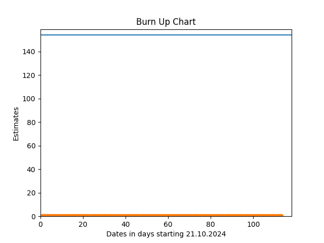

#     GummibaerenProjekt
## Produktziel

Stand vom 25.11.24:
> Das "Aufgaben Kontroll-System" dient als Lehrwerkzeug. Die Lehrkraft kann ein Aufgabenset auf einem Server hochladen, auf das die Schüler:innen über eine Website zugreifen können um die Aufgaben zu bearbeiten. Nachdem sie eine Aufgabe bearbeitet haben, senden sie ihre Lösung ab und erhalten sofort Rückmeldung darüber, ob es korrekt ist. Die Schüler:innen können entweder individuell auf ihren eigenen Geräten oder als Gruppe auf einem gemeinsamen Gerät arbeiten. Währenddessen hat die Lehrkraft die Möglichkeit, den Fortschritt der Nutzer:innen zu verfolgen. Über diese Ansicht kann sie auch Aufgaben entfernen, die noch nicht bearbeitet wurden, oder sie durch andere  Aufgaben zu ersetzen. So kann die Lehrkraft gezielt auf die Leistungen einzelner Schüler:innen reagieren.

## Definition of Done
* Mindestens zwei Personen (die codende Person selbst sowie eine weitere) überprüfen den Code bzw. das Ergebnis mit verschiedenen Testfällen.
* Jedes Increment soll ausführbar sein und vorhandenen Code nicht verschlechtern.
* Code soll lesbar und für andere nachvollziehbar sein. Dazu schreiben wir zum Verständnis nötige Kommentare.
* Der neue Code aus jedem Increment ist im selben Stil geschrieben wie der gesamte vorhergehende Code (Checkstyle Guidelines sollen erfüllt sein)

## Definition of Fun
* Jede Aufgabe hat eine eindeutige Deadline, damit der Scrum-Master den Überblick darüber behält, wer an welcher Aufgabe arbeitet und ob der Zeitplan eingehalten wird. Wir halten uns an diese Deadlines.
* Der Scrum-Master verteilt anstehende Aufgaben, falls niemand sie freiwillig übernimmt. Mit Begründung können so zugeteilte Aufgaben abgelehnt werden. Dabei bleiben alle Beteiligten stets freundlich und verständnisvoll.
* Jeder bearbeitet seine Aufgaben gewissenhaft, und im Sinne des Teams und Projektes. Wer nicht weiterkommt bittet die anderen um Hilfe.
* Wie unterstützen uns gegenseitig bei Problemen jeglicher Art. Wir wollen als Team erfolgreich sein und arbeiten dahingegend zusammen.
* Wir kommunizieren stets offen und ehrlich miteinander. Wir haben stets ein offenes Ohr für die projektbezogenen Probleme der anderen.
* Dienstags wird sich um 11:30 in der Mensa getroffen.

## Burn Up chart
