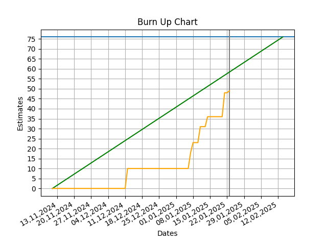

#     GummibaerenProjekt
## Produktziel

Stand vom 07.01.25:
> Mit dem "Aufgaben Kontroll-System" wird Unterricht smarter: Aufgaben verteilen, Ergebnisse vergleichen und Fortschritte in Echtzeit verfolgen – für effektives Lernen und schnelles Handeln im Klassenzimmer. Die Lehrkraft kann ein Aufgabenset auf einem Server hochladen, auf das die Schüler:innen über eine Website zugreifen können um die Aufgaben zu bearbeiten. Nachdem sie eine Aufgabe bearbeitet haben, senden sie ihre Lösung ab und erhalten sofort Rückmeldung darüber, ob sie korrekt ist. Die Schüler:innen können entweder individuell auf ihren eigenen Geräten oder als Gruppe auf einem gemeinsamen Gerät arbeiten. Währenddessen hat die Lehrkraft die Möglichkeit, den Fortschritt der Nutzer:innen zu verfolgen. Über diese Ansicht kann sie auch Aufgaben entfernen, die noch nicht bearbeitet wurden, oder sie durch andere Aufgaben ersetzen. So kann die Lehrkraft gezielt auf die Leistungen einzelner Schüler:innen reagieren.

## Definition of Done
- [ ] Diese Checkliste wird pro Increment von zwei Personen durchlaufen. Mir selbst und einer weiteren Person, die ich gezielt angesprochen habe.
- [ ] Der Code besteht alle Testfälle. [im Backend mit npm run test, ansonsten npm run test:unit]
- [ ] Jede Methode mit Rückgabewert hat mindestens einen von mir selbst erstellten Testfall (Ausnahmen: getter/setter, dummy-methoden, frontends).
- [ ] Jede neue Methode hat einen Kommentar, was sie tut. In diesem Kommentar steht auch etwas zum eventuellen return-wert (Ausnahmen: getter/setter).
- [ ] Dummy-Methoden sind als solche kommentiert.
- [ ] Ich habe mich an unsere Checkstyle Guidelines gehalten. [dafür muss npm run format überall, wo Dinge geändert wurden, ausgeführt werden. Die in frage kommenden Locations sind dabei "shared-backend", "students-frontend" und "teachers-frontend"]

### Zusätzlich für beide frontends
- [ ] Im Vue-Template (html teil) gibt es an typescript code nur einzelne properties und methodenaufrufe.
- [ ] Das Projekt buildet mit meinem Increment ohne Errors und Warnings. [vor allem ohne type errors, npm run build]
- [ ] Emits im template werden mit @... deklariert
- [ ] Das System kann auf dem iPad im Hoch- und Querformat und im Desktop Browser genutzt werden, alles ist sichtbar. Es werden dabei die Geräte verwendet, die einem zu Verfügung stehen [muss nur überprüft werden, wenn es Änderungen an der UI gab]

### Zusätzlich für das students-frontend
- [ ] Das System kann zusätzlich auf dem Handy im Hochformat genutzt werden, alles ist sichtbar. Es werden dabei die Geräte verwendet, die einem zu Verfügung stehen [muss nur überprüft werden, wenn es Änderungen an der UI gab]

## Definition of Fun
* Jede Aufgabe hat eine eindeutige Deadline, damit der Scrum-Master den Überblick darüber behält, wer an welcher Aufgabe arbeitet und ob der Zeitplan eingehalten wird. Wir halten uns an diese Deadlines.
* Der Scrum-Master verteilt anstehende Aufgaben, falls niemand sie freiwillig übernimmt. Mit Begründung können so zugeteilte Aufgaben abgelehnt werden. Dabei bleiben alle Beteiligten stets freundlich und verständnisvoll.
* Jeder bearbeitet seine Aufgaben gewissenhaft, und im Sinne des Teams und Projektes. Wer nicht weiterkommt bittet die anderen um Hilfe.
* Wie unterstützen uns gegenseitig bei Problemen jeglicher Art. Wir wollen als Team erfolgreich sein und arbeiten dahingegend zusammen.
* Wir kommunizieren stets offen und ehrlich miteinander. Wir haben stets ein offenes Ohr für die projektbezogenen Probleme der anderen.
* Dienstags wird sich um 11:30 in der Mensa getroffen.

## Epic:

Stand vom 07.01.25:

In einer kleinen Lerneinheit möchte die Lehrkraft mit den drei Schüler:innen Franz, Niki und Luca das Binärsystem wiederholen. Dafür stellt sie den Schüler:innen die AKS-Website mit den Aufgaben zur Verfügung. Im eingestellten Aufgabenset befinden sich zwei Aufgaben. Die zweite hat eine schwierigere Alternative. Die Schüler:innen gehen auf die Website und geben sich ihren eigenen Namen als Gruppenname. Die Lehrkraft sieht auf ihrer Ansicht die Gruppen, die sich einen Namen gegeben haben.
    Nachdem sich die Schüler:innen ihren Namen eingegeben haben, bekommen sie die erste Aufgabe angezeigt. Es ist einen Aufgabe mit numerischer Lösungseingabe, da hier eine binäre Zahl in eine Dezimalzahl umgewandelt werden muss. Den Schüler:innen wird außerdem angezeigt, dass sie bisher 0 Aufgaben korrekt gelöst haben.
    Sobald den Schüler:innen die erste Frage angezeigt wird, sieht die Lehrkraft durch den blauen Indikator, dass alle drei die erste Aufgabe bearbeiten. Außerdem zählt ein Timer die für die Bearbeitung der Aufgabe verwendete Zeit für jede Schüler:in.
    Niki beantwortet die Frage als erster. Er gibt sein Ergebnis ein und schickt die Antwort ab. Danach bekommt er direkte Rückmeldung über ein Popup, ob seine Antwort richtig oder falsch war. Seine Lösung ist beim ersten Versuch richtig. Der Lehrkraft wird durch einen grünen Indikator angezeigt, dass Niki die Frage korrekt beantwortet hat. Außerdem wird ihr angezeigt, dass Niki einen Versuch für diese Aufgabe gebraucht hat und Nikis Timer für diese Aufgabe in der Lehrkraftansicht stoppt bei 0:50.
    Niki geht nicht direkt zur nächsten Aufgabe sondern schaut sich die Aufgabe und seine Lösung nochmal an
    In der Zwischenzeit gibt Luca Ergebnis ein und schickt die Antwort ab. Auch sie ist beim ersten Versuch richtig, was ihm wieder über ein Popup angezeigt wird. Luca geht direkt weiter zur Bearbeitung der nächsten Aufgabe. Diese wird ihm kurz danach angezeigt. Es handelt sich um einen Multiple Choice Aufgabe. Er sieht auch, dass er nun eine Aufgabe korrekt beantwortet hat. Die Lehrkraft sieht in ihrer Ansicht, dass Luca 1:40 zur Lösung seiner Aufgabe gebraucht hat. Diese wurde nach einenm Versuch richtig beantwortet, wie der grüne Indikator mit der “1” es zeigt. Da Luca schon mit der nächsten Aufgabe begonnen hat, ist sein Indikator für Aufgabe 2 in der Lehrkraftansicht blau und der Timer für diese Aufgabe läuft bereits.
    Als nächstes beantwortet Franz seine Aufgabe zwei mal hintereinander falsch. Jedes mal meldet ihm das Popup, dass er seine Aufgabe falsch beantwortet hat. Bei jeder falschen Beantwortung steigt sein Versuchscounter in der Lehrkraftansicht um 1. Nach den zwei falschen Antworten steht er also auf 2. Auch die Zeit läuft weiter und der Indikator ist immer noch blau.
    Weil Niki die erste Frage so schnell beantwortet hat, stellt die Lehrkraft für seine zweite Aufgabe die schwierigere Alternative B ein. In der Lehreransicht wird Alternative B für Nikis zweite Aufgabe angezeigt
    Niki geht nun zur nächsten Aufgabe und er bekommt Aufgabe 2 - Alternative B angezeigt. Es handelt sich um eine Multiple Choice Aufgabe. Der Lehrkraft wird durch den blauen Indikator und den laufenden Timer angezeigt, dass Niki nun Aufgabe 2 - Alternative B bearbeitet.
    Die Lehrkraft stellt für Franz ein, dass die zweite Aufgabe übersprungen werden soll. In der Lehrkraftansicht wird der Indikator für Franz’ zweite Aufgabe rot.
    Franz sendet nun eine korrekte Lösung für Aufgabe 1 ab. Ihm wird per Popup angezeigt, dass seine Lösung diesmal richtig war. In der Lehrkraftansicht wird der grüne Indikator für Franz’ Aufgabe 1 angezeigt.
    Franz versucht zur nächsten Aufgabe zu gehen, doch da die Lehrkraft seine nächste Aufgabe als geskippt markiert hat, bekommt er, nach dem er “nächste Aufgabe” ausgewählt hat lediglich angezeigt, dass er seine Bearbeitung nun beendet hat. Der Lehrkraft wird die gesamte Bearbeitungszeit von Franz angezeigt - 3:00
    Kurz danach ist der Akku von Lucas Gerät leer. Er holt sich ein neues iPad und verbindet sich wieder mit der Website. Dazu gibt er seinen Gruppennamen ein und bekommt wieder seine aktuelle Aufgabe (Aufgabe 2, Alternative A) angezeigt.
    Niki und kurz später auch Luca schicken eine korrekte Antwort für Aufgabe 2 ab, jeder jeweils für seine Variante. Der Erfolg wird ihnen per Popup zurückgemeldet. Der Lehrkraft wird per grünen Indikator angezeigt, dass die beiden nun die letzte Aufgabe nach dem ersten Versuch korrekt beantwortet haben. Luca jeweils die Standartalternative A und Niki die schwierigere Alternative B. Auch die Bearbeitungszeiten für Aufgabe 2 werden angezeigt.
    Luca wählt “nächste Aufgabe”. Da es keine weitere Aufgabe mehr gibt, wird ihm angezeigt, dass er seine Bearbeitung beendet hat. Auch die Lehrkraft sieht das, da eine gesamte Bearbeitungszeit von 3:20 für Luca angezeigt wird.
    Kurze Zeit später wählt auch Niki “nächste Aufgabe”. Da es auch für ihn keine weitere Aufgabe mehr gibt, wird ihm angezeigt, dass er seine Bearbeitung beendet hat. Auch die Lehrkraft sieht das, da eine gesamte Bearbeitungszeit von 3:30 für Niki angezeigt wird.

## wichtige Entscheidungen
* Die Ansicht für Lehrkräfte wird nur für den Desktop-Browser und das IPad im Hoch- und Querformat optimiert.
* Die Systeme bleiben vorerst getrennt und werden erst am Ende eventuell zusammengefügt. [was ist damit gemeint?]
* Im Backend gibt es einen zentralen Emit an das teachers-frontend, der bei jeder Änderung neu ausgelöst wird
* Für eine abschließenden Systemtest der frontends haben wir uns folgende Geräte ausgesucht:
    * Fabi: Android - Chromium Ecosia Browser
    * Felix: IPad - Safari Browser 
    * Jonathan: MacBook - Safari Browser, Windows 11 4K - Chrome Browser
    * Jonas: Windows 11 - Firefox Browser
* Unit-Tests machen wir ausschließlich im Backend, da alle Programmlogik nach MVC dort implementiert ist. Dabei konzentrieren wir uns auf ein vollständige Testabdeckung der  Entities (Model). Für die Services (Teil des Controllers) testen wir alle Codestellen, die wir mit den implementierten Interfaces erreichen können.

## Burn Up chart

## Weitere Readme-Dateien
* [Backend](shared-backend/README.md)
* [Students-Frontend](students-frontend/README.md)
* [Teachers-Frontend](teachers-frontend/README.md)
