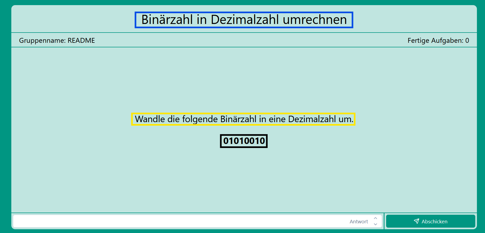
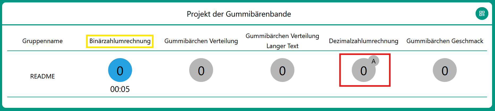

# Backend

## Inhaltsverzeichnis

- [Scripts](#scripts)
- [Ansichten und Aufbau](#ansichten-und-aufbau-der-aufgaben)
- [Übungstypen](#übungstypen)
- [Aufgabenerstellung](#aufgabenerstellung)

## Scripts

Mit `npm install` werden alle genutzten Packages des Backends installiert.<br>
Mit `npm run start` wird das Backend gestartet.

## Ansichten und Aufbau der Aufgaben

### Ansicht einer Aufgabe aus Sicht der Schüler:innen

Die Schüler:innen bearbeiten die Aufgaben eines Aufgabensets. Dieses Aufgabenset besteht aus einer oder mehreren Aufgaben ([Task](./src/entities/Task.ts)).<br>
Jede Aufgabe besteht aus einer oder mehreren Übungen ([Exercise](./src/entities/abstract/Exercise.ts)). Die sichtbaren Bestandteile einer Übung sind ein Übungsname (blauer Kasten), eine Beschreibung (gelber Kasten) sowie eine Fragestellung (schwarzer Kasten). Jeder Übung wird beim Starten automatisch eine ID zugeordnet, außerdem muss die Lösung im Vorfeld festgelegt werden. Es gibt [verschiedene Übungstypen](#übungstypen) und je nach Übungstyp wird die Lösung unterschiedlich übergeben. Wie das geschieht wird [weiter unten](#aufgabenerstellung) erklärt.<br><br>
<br>

### Ansicht der Lehrkräfte

Jede Aufgabe, die aus mindestens einer der eben beschriebenen Übungen besteht, benötigt noch einen Aufgabentitel (gelber Kasten). Dieser Aufgabentitel ist nur im teachers-frontend zu sehen.<br>
Im roten Kasten ist die Anzeige einer Aufgabe zu sehen. Falls diese Aufgabe aus mehr als einer Übung besteht, so wird im Kreis oben rechts angezeigt, welche Übung zur Zeit ausgewählt ist. Standardmäßig ist die erste Übung ausgewählt, weitere können durch klick auf die Aufgabe ausgewählt werden.<br><br>
<br>

## Übungstypen

| Klassenname                                                        | Eigenwerte                                                            |
| ------------------------------------------------------------------ | --------------------------------------------------------------------- |
| [NumericalExercise](./src/entities/NumericalExercise.ts)           | Antwort: Ganzzahl                                                     |
| [MultipleChoiceExercise](./src/entities/MultipleChoiceExercise.ts) | Antwortmöglichkeiten: String Array<br> Antwortindizes: Ganzzahl Array |

## Aufgabenerstellung

Die Aufgabenliste findet sich aktuell [hier](/shared-backend/src/taskList.ts).<br>
Um eine neue Aufgabe zu erstellen, wird folgender Code verwendet:

```TypeScript
new Task("Aufgabenname in der Lehrkraftansicht",
    [
        new NumericalExercise("Aufgabentitel für Schüler:innen", "Aufgabenbeschreibung", "Frage", Lösungszahl),
        new MultipleChoiceExercise("Aufgabentitel für Schüler:innen", "Aufgabenbeschreibung", "Frage",
            ["Antwortmöglichkeit1", "Antwortmöglichkeit2", "Antwortmöglichkeit3"], [Lösungsindex1, Lösungsindex2]
            )
    ]
 )
```

MultipleChoiceExercises können eine beliebige Anzahl an Antwortmöglichkeiten und Lösungsindizes haben. Die Lösungsindizes geben dabei vor, welche der Antwortmöglichkeiten korrekt sind. Dabei ist der Lösungsindex von Antwortmöglichkeit1 0, von Antwortmöglichkeit2 1 usw.<br>
Mit dieser Syntax wird eine Aufgabe mit einer Alternative erstellt. Beliebig viele solcher Aufgaben können in einem Array gespeichert werden, um ein Aufgabenset zu erstellen. Dieses Array liegt [hier](/shared-backend/src/taskList.ts) und wird in Zeile 8 geöffnet.<br>
Aktuell lässt sich, unabhängig davon, ob eine erstellt wurde, für die erste Aufgabe keine Alternative auswählen, da die Schüler:innen direkt mit der Bearbeitung der ersten Aufgabe starten sobald sie sich registriert haben.<br>
Das Aufgabenset, welches in der `taskList.ts` Datei gespeichert ist wird aktuell beim Starten des Servers automatisch geladen.
