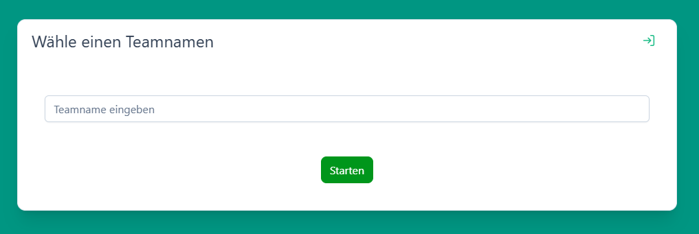
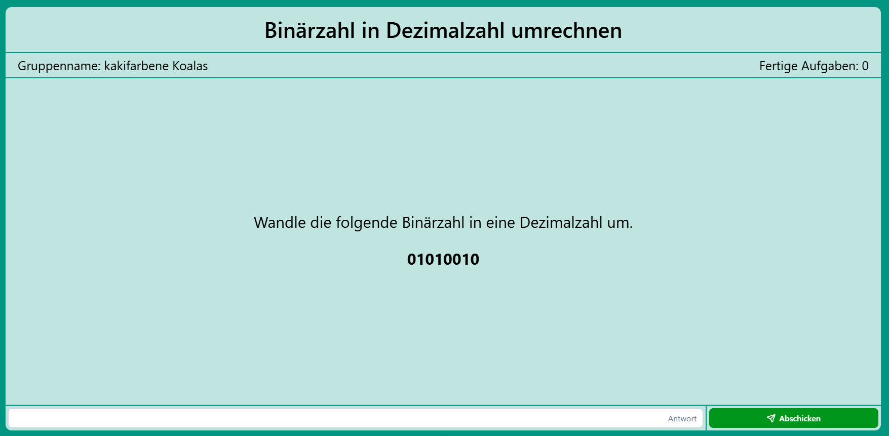
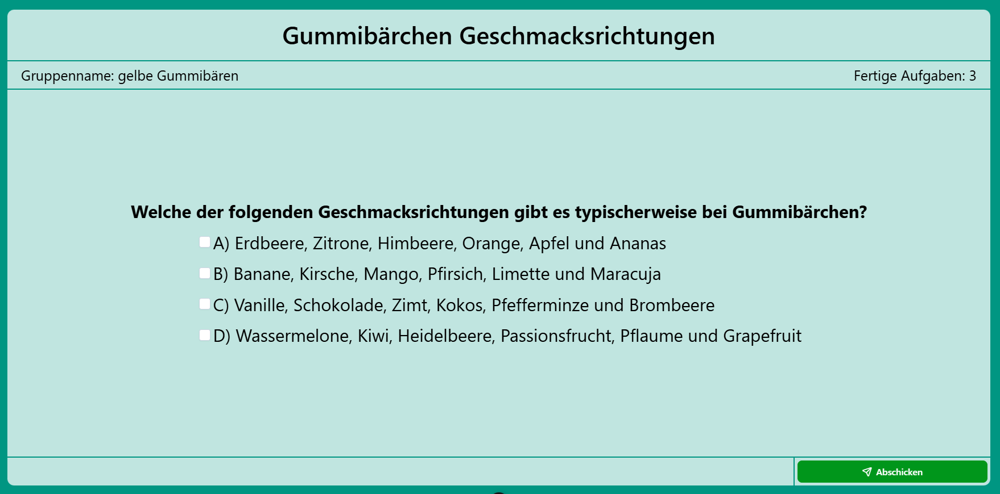
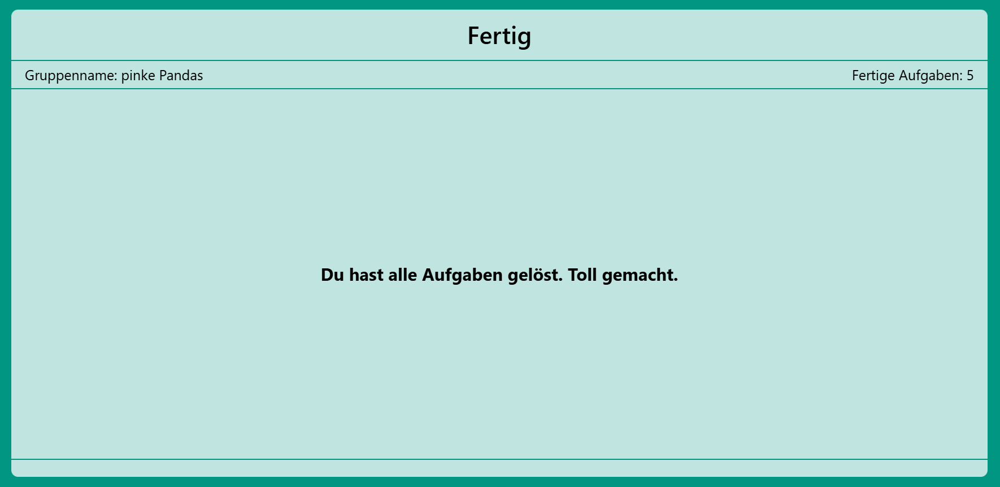

# students-frontend

## Inhaltsverzeichnis

- [Scripts](#scripts)
- [Login & Reconnect](#login-ansicht-und-reconnect)
- [Aufgaben](#aufgabenansicht)
- [Endansicht](#endansicht)

## Scripts

| Konsolenbefehle      |                                             |
| :------------------- | :------------------------------------------ |
| `npm install`        | Installiert alle Packages dieses Frontends  |
| `npm run build`      | Kompiliert das Projekt **mit** Type-Checks  |
| `npm run build-only` | Kompiliert das Projekt **ohne** Type-Checks |
| `npm preview`        | Hosted das Frontend auf Port 8080           |

Das kompilierte Frontend kann im `dist`-Ordner gefunden werden

## Login-Ansicht (und Reconnect)

Wenn die Schüler:innen den QR-Code gescannt oder den Link eingegeben haben, öffnet sich eine Login Seite. Hier können die Schüler:innen einen Gruppennamen eingeben und dann über den `Starten`-Button mit der Bearbeitung beginnen. 
Sollte eine Gruppe währen der Bearbeitung das Gerät wechseln, so kann sie sich wieder einloggen und mit der Bearbeitung fortfahren. Das geht über den Reconnect-Button oben rechts im Login Fenster. Dort kann die Gruppe ihren Namen wieder eingeben und über den `Weiterarbeiten`-Button die Bearbeitung fortsetzen. 
 

## Aufgabenansicht

Jede Gruppe sieht oben im Fenster den Namen der aktuellen Aufgabe. Darunter steht links der Gruppenname, rechts wird angezeigt, wie viele Aufgaben die Gruppe bereits korrekt gelöst hat.

### Numerical Exercise

Aufgaben mit numerischer Antwort bieten ein Eingabefeld in dem `Antwort` steht. Sobald die Schüler:innen in dieses Feld ihre Antwort als Ganzzahl eingegeben haben, können sie durch Klicken des `Abschicken`-Buttons ihre Antwort überprüfen lassen. Bei einer falschen Antwort poppt eine Benachrichtigung darüber auf und die Gruppe kann eine weitere Antwort eingeben. Bei einer richtigen Antwort wird die Gruppe direkt zur nächsten Aufgabe weitergeleitet.

### Multiple-Choice Exercise

Multiple-Choice Aufgaben zeigen die Antwortmöglichkeiten an. Diese können durch Klicken ausgewählt werden. Danach können die Schüler:innen wieder durch `Abschicken` ihre Lösung verifizieren lassen.

## Endansicht

Wenn eine Gruppe alle Aufgaben fertig bearbeitet hat wird ihr eine abschließende Anzeige präsentiert.

