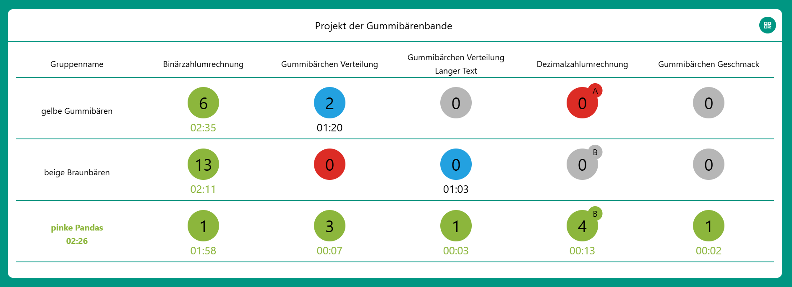
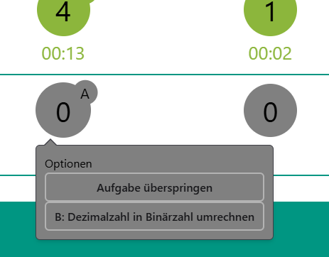

# teachers-frontend
## Gruppenübersicht
Sobald die Lehrkraft das Programm gestartet hat, bekommt sie eine zu Beginn leere Tabelle angezeigt. Die sichtbare Zeile zeigt dabei die Namen der Aufgaben an, in der ersten Spalte werden die Namen der Gruppen angezeigt, sobald diese registriert sind. 
Oben rechts befindet sich ein Button mit QR-Code Symbol. Durch Klicken dieses Buttons öffnet sich ein QR-Code, den die Schüler:innen scannen können, um sich als Gruppe zu registrieren.
  
Diese Tabelle füllt sich, wenn sich nach und nach die Gruppen anmelden. Im Laufe der Bearbeitung könnte die Bearbeitung wie folgt aussehen: 
 
Dabei gibt es für die verschiedenen Bearbeitungsfortschritte der einzelnen Aufgaben vier Farben: 
- Grau steht für eine unbearbeitete, noch nicht begonnene Aufgabe.
- Grün steht für eine erfolgreich bearbeitete Aufgabe.
- Blau steht für eine Aufgabe, die gerade bearbeitet wird.
- Rot steht für eine Aufgabe, die übersprungen wurde.

Unter begonnenen Aufgaben erscheint ein Timer, der anzeigt, wie lange die Gruppe für die jeweilige Aufgabe braucht. Dieser Timer stoppt, sobald die Aufgabe richtig beantwortet wurde. 
In der Anzeige einer Aufgabe wird angezeigt, wie viele Antwortversuche die Gruppe bisher getätigt hat. 
Falls eine Aufgabe Alternativ-Übungen hat, so werden diese in einem kleine Kreis oben rechts an der Aufgabe angezeigt. In dieser Anzeige steht auch immer, welche Übung gerade ausgewählt ist. 
Sobald eine Gruppe mit allen Übungen fertig ist, erscheint unter ihrem Gruppennamen ein grüner Timer, der angibt, wie lange die Gruppe insgesamt zur Bearbeitung benötigt hat. Außerdem färbt sich der Gruppenname grün. 
Durch Klicken der Aufgabe, öffnet sich ein Menü mit Optionen. Aufgaben, die keine Alternativ-Übungen haben, haben nur die Option, die Aufgabe zu überspringen. Falls die Aufgabe Alternativ-Übungen hat, so werden diese im Menü angezeigt. Eine übersprungen Aufgabe kann über das Menü reaktiviert werden. 

